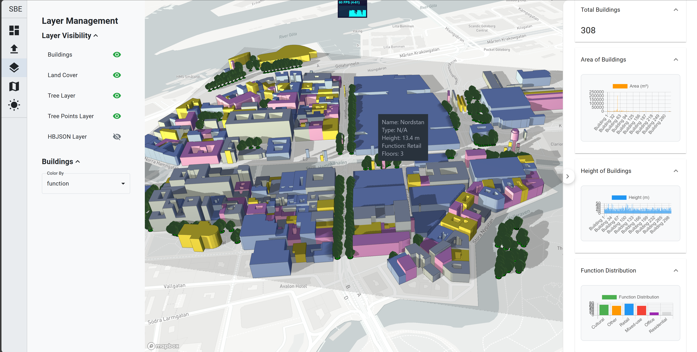

# SBE Viewer

## Overview
The GIS Viewer Application is a React-based project designed to load, view, and filter GIS files. It provides a user-friendly interface for visualizing geographic data and supports various file formats.



## Features
- Load and display GIS files (e.g., GeoJSON, Shapefiles)
- Filter data based on user-defined criteria
- Interactive map viewer for exploring geographic information
- Sunlight simulation with adjustable time settings
- Layer settings for toggling visibility, changing variables, and colormaps

## Project Structure
```
gis-viewer-app
├── src
│   ├── App.tsx                # Main entry point of the application
│   ├── components             # React components
│   │   ├── LeftDrawer.tsx
│   │   ├── LayerSettings.tsx
│   │   ├── MapComponent.tsx
│   │   ├── MapViewer.tsx
│   │   ├── PopupComponent.tsx
│   │   ├── SunlightSlider.tsx
│   │   └── tooltip.css
│   ├── config                 # Configuration files
│   │   └── mapbox.ts
│   ├── types                  # TypeScript interfaces and types
│   │   ├── d3-scale-chromatic.d.ts
│   │   ├── index.ts
│   │   └── types.ts
│   ├── utils                  # Utility functions
│   │   ├── colormapHelpers.ts
│   │   ├── fileParser.ts
│   │   ├── gisDataLoader.ts
│   │   └── layersConfig.ts
│   ├── index.css              # Global CSS styles
│   ├── index.tsx              # Main entry point for React
│   ├── mapbox-gl-geocoder.d.ts
│   └── react-app-env.d.ts
├── public
│   ├── index.html             # Main HTML file for the React application
│   ├── sample-data.geojson    # Sample GIS data
│   └── sample-data copy.geojson
├── .babelrc                   # Babel configuration
├── .env                       # Environment variables
├── .gitignore                 # Git ignore file
├── package.json               # npm configuration file
├── tsconfig.json              # TypeScript configuration file
├── webpack.config.js          # Webpack configuration file
└── README.md                  # Project documentation
```

## Installation
1. Clone the repository:
   ```
   git clone <repository-url>
   ```
2. Navigate to the project directory:
   ```
   cd sbe_viewer
   ```
3. Install the dependencies:
   ```
   npm install
   ```

## Usage
To start the application, run:
```
npm run start-all
```
This will launch the application in your default web browser.

## Contributing
Contributions are welcome! Please open an issue or submit a pull request for any enhancements or bug fixes.

## License
This project is licensed under the MIT License.